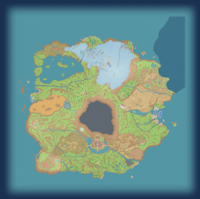

# Convert to ASCII

  
  
  ### Transform your images into ASCII art instantly
  
  [**Try it now at convert2ascii.com**](https://convert2ascii.com/)
  
  
  

## 🎨 Preview

  <table>
    <tr>
      <td align="center">
        <strong>Original Image</strong> 
        
      </td>
      <td align="center">
        <strong>ASCII Art</strong> 
        
      </td>
    </tr>
  </table>
  

## ✨ Features

- **🖼️ Multiple Input Methods** - Drag & drop, click to upload, or paste from clipboard
- **🎨 Color Support** - Convert to monochrome or full-color ASCII art
- **⚙️ Customizable Settings**
  - Adjustable output width (10-200 characters)
  - Multiple character sets (Default, Dense, Minimal, Extended)
  - Invert colors option
  - Font size control (8px-24px)
  - Zoom controls (50%-200%)
- **💾 Export Options**
  - Copy to clipboard
  - Save as .txt file (plain text)
  - Save as .html file (with colors preserved)
  - Save as .png image (preserves colors!)
- **🔒 Privacy First** - All processing happens in your browser, no data is sent to servers
- **📱 Responsive Design** - Works seamlessly on desktop and mobile devices
- **⚡ Real-time Preview** - See changes instantly as you adjust settings

## 🎯 Key Features Explained

### ASCII Conversion Algorithm
The conversion algorithm (`src/lib/ascii_converter.ts`) maps pixel brightness to ASCII characters. It includes:
- Automatic aspect ratio correction (characters are at a 2:1 height:width ratio)
- Color preservation for full-color ASCII art
- Customizable character sets for different artistic styles

### Privacy-First Design
- All image processing uses the HTML Canvas API
- No external API calls
- No analytics or tracking
- Images never leave your browser

### Responsive and Accessible
- Mobile-friendly interface
- Keyboard navigation support
- Clear visual feedback
- Loading states and error handling

## 📝 License

This project is licensed under the MIT License - see the [LICENSE](LICENSE) file for details.